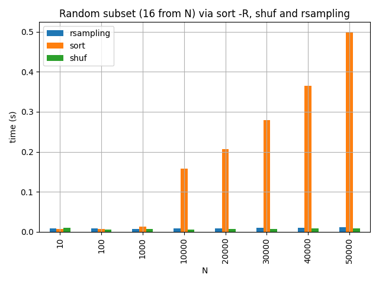
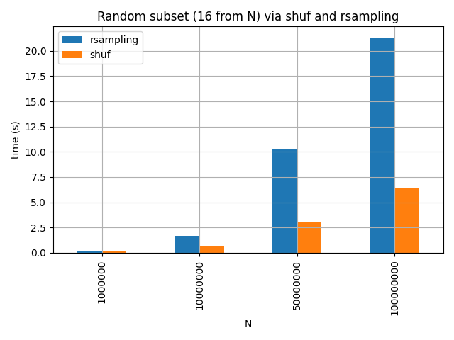
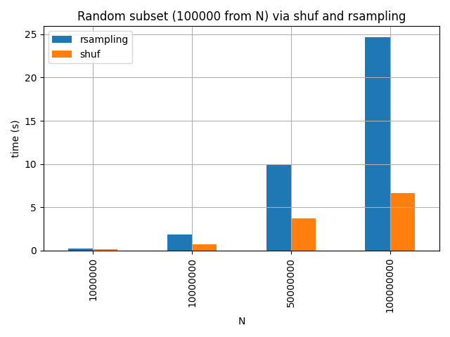

# rsampling

Simple [reservoir
sampling](https://en.wikipedia.org/wiki/Reservoir_sampling#Algorithm_R) for the
command line. Works on lines.

> An algorithm for randomly choosing a sample of *k* items from a list *S*
> containing *n* items, where *n* is either a very large or unknown number.
> Typically *n* is large enough that the list doesn't fit into main memory.

Original paper: [Random Sampling with a Reservoir](http://www.cs.umd.edu/~samir/498/vitter.pdf) (1985)

## Install
```
$ go get github.com/miku/rsampling/cmd/...
```

Or some [release](https://github.com/miku/rsampling/releases).

## Usage

```
$ rsampling -h
Usage of rsampling:
  -r int
        random seed (default 945553340)
  -n int
        number of samples to obtain (default 16)

$ seq 100 | rsampling -s 8
71
21
83
39
81
47
89
77
```

## Performance

Sometimes a

```
sort -R | head -10
```

is fast enough, but sometimes it is not:

```
$ time sort -R fixtures/b | head -10
630163
119338
52446
774497
425201
849943
735918
964258
492182
20209

real    0m19.137s
user    1m12.019s
sys     0m0.205s

$ time rsampling -n 10 < fixtures/b
624611
645730
368278
871774
388413
546190
605655
178735
16707
298563

real    0m0.187s
user    0m0.168s
sys     0m0.013s
```

## Comparison to sort and shuf

Options:

```
$ seq 100 | rsampling -n 16
$ seq 100 | sort -R | head -16
$ seq 100 | shuf -n 16
```

Sort, shuf and rsampling.



Shuf and rsampling, small subset.



Shuf and rsampling, larger subset.



----

Visual impression of reservoir sampling:


